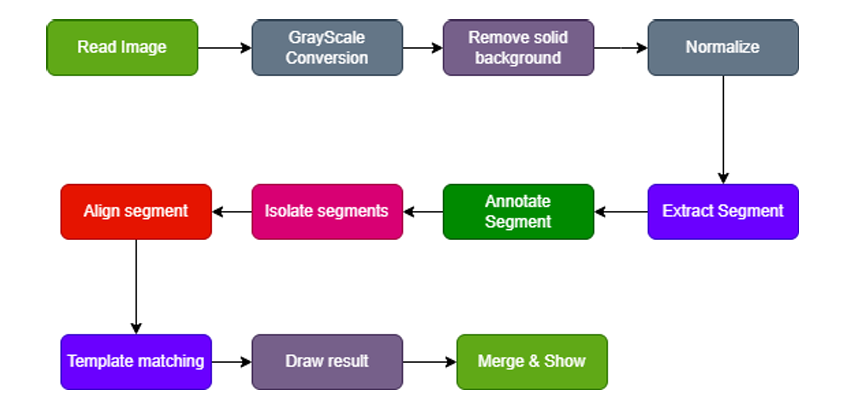

### Digit recognition from image

### Introduction
The primary focus of this project is to extract and identify distinct segments within an image(digits(0-9)) and apply different image processing techniques to analyze these segments and produce results.

### Tools used
The following tools are used in the project:
- Programming language– Python
- Libraries
    - `cv2` for image read, write, resize
    - `numpyfor` fast and easier calculation in array.
    - `colorsys` for generating random color for annotating.
    - `mathfor` few mathematical operations and constant.
    - `collections` for datastructure like defaultdict, deque etc.
- Interface
    - `tkinter` for user interface.
    - `PIL` for making image suitable for tkinter

### Methodology

